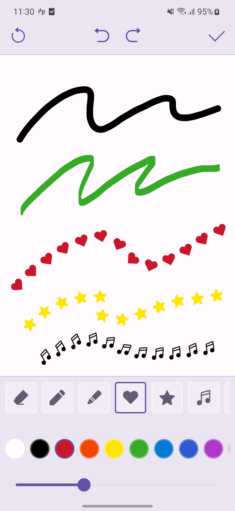

# BrushKit
BrushKit is an Android library that enables users to draw using a variety of brushes.
You can use the library to create brushes that mimic the behavior of real-world brushes, like pens, markers, paintbrushes and many more.




## Features
- A brush framework capable of simulating various types of realistic brushes
- A brush view for drawing with different brushes
- History management for undoing and redoing actions
- Export the drawing result as a bitmap or retrieve the drawing paths

## Usage

1. Use Gradle to build the library

```shell
./gradlew publish
```
The output library will be in the `build/repo/` directory

2. Include the library in your project by adding the following code to your build.gradle file

```groovy
implementation(files("path/to/brushkit.aar"))
```

3. Create a brush collection that defines the styles of the brushes you want to use

```kotlin
val brushDataProvider = object : BrushDataProvider {
    private val brushList = listOf(
        Brush(
            id = "marker",
            thumbnail = BrushIcon.Drawable(R.drawable.ic_brush_marker),
            style = BrushStyle.Image(
                initialSizeDp = 10f,
                initialColor = Color.BLACK,
                imageResId = R.drawable.brush_tip_marker,
            ),
            spacingInputConfigs = listOf(BrushInputConfig.Constant(0.05f)),
        ),
    )

    override fun getBrush(brushId: String): Brush? =
        brushList.find { it.id == brushId }
}
```

4. Create the BrushView to allow users to draw on it

```kotlin
var brushOperationManager = BrushOperationManagerFactory.create(
    context = context,
    brushDataProvider = brushDataProvider,
)
var brushView = BrushView(
    context = context,
    brushOperationManager = brushOperationManager
)
```

5. Control the drawing using the `BrushOperationManager`

```kotlin
// To set a brush
brushOperationManager.setBrush(brush, brushSetting)
// To undo
brushOperationManager.undo()
// To redo
brushOperationManager.redo()
// To clear
brushOperationManager.clear()
```    

6. Export the drawing result

```kotlin
// Export the drawing result as a bitmap
val bitmap = brushView.exportBrushBitmapWithBounds()

// Retrieve the drawing path
val brushPaths = brushOperationManager.getBrushPaths()
```

For other usages, please check out the `sample` project.

## Contributing

Pull requests are welcome. For major changes, please open an issue first
to discuss what you would like to change.

For more information, please check out the [CONTRIBUTING](CONTRIBUTING.md) file.

## License
```
Copyright 2025 LY Corporation

Licensed under the Apache License, Version 2.0 (the "License");
you may not use this file except in compliance with the License.
You may obtain a copy of the License at

   http://www.apache.org/licenses/LICENSE-2.0

Unless required by applicable law or agreed to in writing, software
distributed under the License is distributed on an "AS IS" BASIS,
WITHOUT WARRANTIES OR CONDITIONS OF ANY KIND, either express or implied.
See the License for the specific language governing permissions and
limitations under the License.
```
